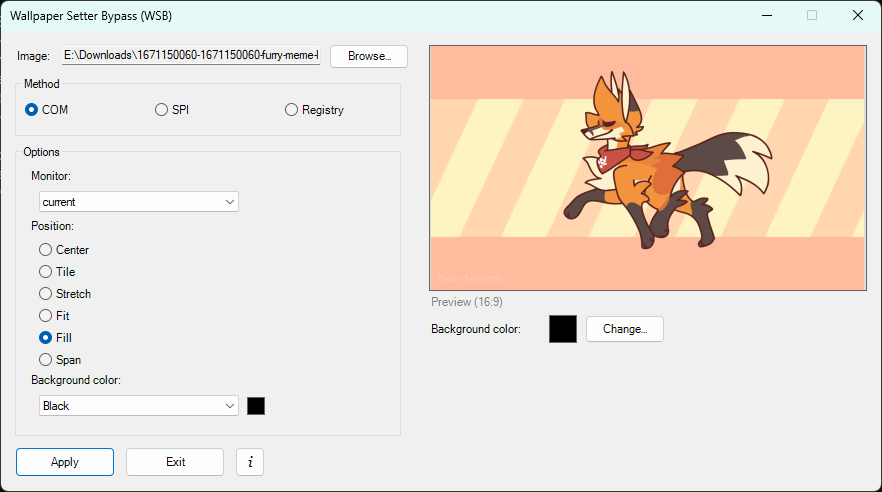
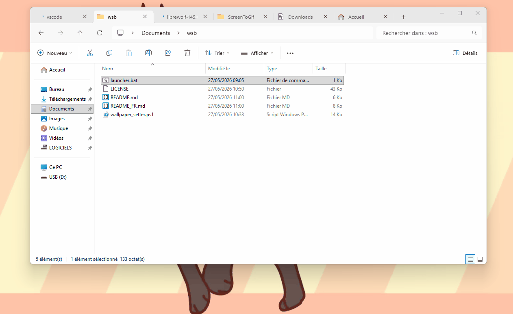

# Wallpaper Setter Bypass (WSB)

 &nbsp; 

**Français** | [English](README.md)

Application PowerShell qui contourne l'interface native de Windows pour définir les fonds d'écran directement avec options avancées de mise à l'échelle, de style et de couleur d'arrière-plan. Fonctionne sans privilèges administrateur.






## Fonctionnalités

- [x] **Support Triple Méthode** : Choisir entre la méthode COM (IDesktopWallpaper), l'API Win32 classique (SPI) ou la manipulation directe du registre
- [x] **Mode GUI** : Interface graphique interactive pour une sélection facile du fond d'écran
- [x] **Mode CLI** : Interface en ligne de commande pour l'automatisation et les scripts
- [x] **Validation d'image** : Validation automatique pour détecter les fichiers image corrompus ou invalides
- [x] **Modes d'affichage** : Center, Tile, Stretch, Fit, Fill, Span (selon la méthode choisie)
- [x] **Couleur d'arrière-plan** : Sélection et aperçu en direct de la couleur de bureau affichée derrière le fond d'écran (méthode COM uniquement)
- [x] **Support Multi-Moniteur** : Appliquer le fond d'écran sur un moniteur spécifique, tous les moniteurs, ou étendre une seule image sur tous les écrans (méthode COM)
- [x] **Aperçu d'image** : Aperçu 16:9 en direct de l'image sélectionnée avant application
- [x] **Pas de Droits Admin** : Fonctionne sans privilèges administrateur
- [x] **Référence des méthodes** : Bouton d'information intégré expliquant en détail chaque méthode et ses cas d'usage

## Formats d'image supportés

- JPG / JPEG
- PNG
- BMP
- GIF
- TIFF / TIF

## Configuration requise

- Windows 7 ou version ultérieure
- PowerShell 5.1 ou version ultérieure
- Aucun droit spécial requis

## Utilisation

### Mode GUI (Interactif)

Exécutez simplement le fichier launcher batch :

```cmd
launcher.bat
```

Ou exécutez directement le script PowerShell :

```powershell
.\wallpaper_setter.ps1
```

Cela ouvre une fenêtre où vous pouvez :

1. Cliquer sur **`Browse…`** pour sélectionner un fichier image
2. Voir l'aperçu 16:9 de l'image sur le côté droit
3. Choisir la **méthode** d'application :
   - **COM** *(recommandé)* : Méthode moderne via l'interface Shell Windows, avec support par moniteur, styles avancés et couleur d'arrière-plan
   - **SPI** : API Win32 classique, application globale sur tous les moniteurs, rarement bloquée en environnement géré
   - **Registry** : Écriture directe dans le registre, dernier recours si COM et SPI échouent
4. Configurer les **options** selon la méthode choisie (voir détails ci-dessous)
5. *(Méthode COM uniquement)* Modifier la **couleur d'arrière-plan** via le bouton `Change…` — visible derrière le fond d'écran quand il ne couvre pas tout l'écran
6. Cliquer sur **`Apply`** pour définir le fond d'écran
7. Cliquer sur **`Exit`** pour fermer sans appliquer
8. Cliquer sur **`i`** pour consulter la référence détaillée des méthodes

#### Options par méthode

**COM** — `IDesktopWallpaper` (par défaut)

| Option | Valeurs | Description |
|---|---|---|
| Monitor | `current`, `primary`, `all`, index numérique | Moniteur cible. `current` = moniteur sous le curseur |
| Position | `Center`, `Tile`, `Stretch`, `Fit`, `Fill`, `Span` | Style d'affichage |
| Background color | `Black`, `White`, `Gray`, `Dark Gray`, `Navy`, `Dark Green`, `Maroon`, `Custom…` | Couleur affichée derrière l'image |

**SPI** — `SystemParametersInfo`

| Option | Valeurs | Description |
|---|---|---|
| Display mode | `fullscreen`, `tile` | Style d'affichage global |
| Stretch to fill | case à cocher | Étire l'image (mode fullscreen uniquement) |
| Span across all monitors | case à cocher | Traite tous les moniteurs comme un seul canvas |

**Registry** — Écriture directe

| Option | Valeurs | Description |
|---|---|---|
| Display mode | `fullscreen`, `tile` | Style d'affichage (fullscreen = WallpaperStyle 6, tile = WallpaperStyle 1) |

### Mode CLI (Ligne de commande)

```powershell
.\wallpaper_setter.ps1 -Path "C:\chemin\vers\image.jpg" [Options]
```

#### Options communes

| Option | Description |
|---|---|
| `-Path <chemin>` | Chemin complet du fichier image *(obligatoire pour le mode CLI)* |
| `-Method <méthode>` | Méthode : `COM` (défaut), `SPI`, `Registry` |
| `-Help` | Afficher le message d'aide |

#### Options COM

| Option | Description |
|---|---|
| `-Monitor <valeur>` | `primary` (défaut), `all`, `current`, ou index numérique (`0`, `1`, `2`…) |
| `-Position <valeur>` | `Center`, `Tile`, `Stretch`, `Fit`, `Fill` (défaut), `Span` |
| `-BgColor <valeur>` | `Black` (défaut), `White`, `Gray`, `Dark Gray`, `Navy`, `Dark Green`, `Maroon` |

#### Options SPI

| Option | Description |
|---|---|
| `-DisplayMode <mode>` | `fullscreen` (défaut) ou `tile` |
| `-Stretch` | Étirer l'image (fullscreen uniquement) |
| `-Spanned` | Étendre sur tous les moniteurs |

#### Options Registry

| Option | Description |
|---|---|
| `-DisplayMode <mode>` | `fullscreen` (défaut) ou `tile` |

#### Exemples

Appliquer sur le moniteur courant (COM, Fill) :
```powershell
.\wallpaper_setter.ps1 -Path "C:\images\fond.jpg"
```

Appliquer sur le moniteur principal avec position Fit :
```powershell
.\wallpaper_setter.ps1 -Path "C:\images\fond.jpg" -Method COM -Monitor primary -Position Fit
```

Appliquer sur le moniteur 1 avec fond bleu marine :
```powershell
.\wallpaper_setter.ps1 -Path "C:\images\fond.jpg" -Method COM -Monitor 1 -BgColor Navy
```

Étendre sur tous les moniteurs (Span) :
```powershell
.\wallpaper_setter.ps1 -Path "C:\images\fond.jpg" -Method COM -Position Span
```

Appliquer via SPI en mode tile :
```powershell
.\wallpaper_setter.ps1 -Path "C:\images\fond.jpg" -Method SPI -DisplayMode tile
```

Appliquer via SPI étendu sur tous les moniteurs :
```powershell
.\wallpaper_setter.ps1 -Path "C:\images\fond.jpg" -Method SPI -Spanned
```

Appliquer via la méthode Registre :
```powershell
.\wallpaper_setter.ps1 -Path "C:\images\fond.jpg" -Method Registry
```

Afficher l'aide :
```powershell
.\wallpaper_setter.ps1 -Help
```

## Comment ça fonctionne

WSB contourne l'interface graphique Windows standard en modifiant directement la configuration du fond d'écran via trois méthodes indépendantes :

**Méthode COM** — La plus complète. Utilise l'interface COM `IDesktopWallpaper` exposée par le Shell Windows. Permet l'adressage par moniteur (via le chemin de périphérique), le choix du style de positionnement parmi six options, et le contrôle de la couleur d'arrière-plan du bureau. C'est la méthode native sur Windows 8 et ultérieur, mais elle est fréquemment bloquée par les stratégies de groupe en environnements managés (entreprises, établissements scolaires, bornes).

**Méthode SPI** — Utilise l'appel Win32 `SystemParametersInfo` (action `SPI_SETDESKWALLPAPER`). Écrit d'abord le style souhaité dans le registre (`HKCU\Control Panel\Desktop`), puis déclenche la mise à jour via l'API. Application globale uniquement (tous les moniteurs reçoivent la même image). Rarement bloquée, c'est le meilleur repli quand COM est indisponible.

**Méthode Registry** — Écrit directement les valeurs `Wallpaper`, `WallpaperStyle` et `TileWallpaper` dans `HKCU\Control Panel\Desktop`, puis force l'actualisation du bureau. Fonctionnalités limitées (fullscreen ou tile uniquement, pas de support par moniteur). À utiliser en dernier recours.

Dans tous les cas, l'actualisation est immédiate — aucun redémarrage ni déconnexion n'est nécessaire.

## Dépannage

**Erreur de politique d'exécution PowerShell ?**

Utilisez le fichier launcher batch :
```cmd
launcher.bat
```
Ou autorisez l'exécution pour l'utilisateur courant :
```powershell
Set-ExecutionPolicy -ExecutionPolicy Bypass -Scope CurrentUser
```

**L'image n'est pas appliquée ?**

- Vérifiez que le chemin du fichier image est correct et que le format est supporté
- Si la méthode COM échoue (environnement restreint), essayez la méthode SPI
- Si SPI échoue également, essayez la méthode Registry
- Consultez la console pour les messages d'erreur détaillés

**La couleur d'arrière-plan ne s'applique pas ?**

La couleur d'arrière-plan est une fonctionnalité exclusive à la méthode COM. Elle n'est pas disponible avec SPI ou Registry. Si COM est bloqué dans votre environnement, la couleur d'arrière-plan ne peut pas être modifiée via WSB.

**L'aperçu ne se charge pas ?**

L'aperçu peut ne pas se charger pour les formats non supportés ou les fichiers corrompus. Vous pouvez toujours appliquer le fond d'écran en saisissant le chemin manuellement.

## Notes

- L'application stocke le chemin du fond d'écran dans votre registre utilisateur (`HKCU\Control Panel\Desktop`)
- Les chemins réseau (chemins UNC) sont supportés
- Les fichiers image sont validés avant traitement
- En mode GUI, le bouton `i` donne accès à une référence complète des méthodes directement dans l'application

## Licence

Ce projet est distribué sous la **Licence LGPL v3 (GNU Lesser General Public License v3)**. Consultez le fichier [LICENSE](LICENSE) pour plus de détails.

## Contributions

Les contributions, améliorations et pull requests sont acceptées avec plaisir ! N'hésitez pas à :

- Signaler des problèmes
- Soumettre des pull requests avec des améliorations
- Suggérer de nouvelles fonctionnalités

Merci pour l'aide !